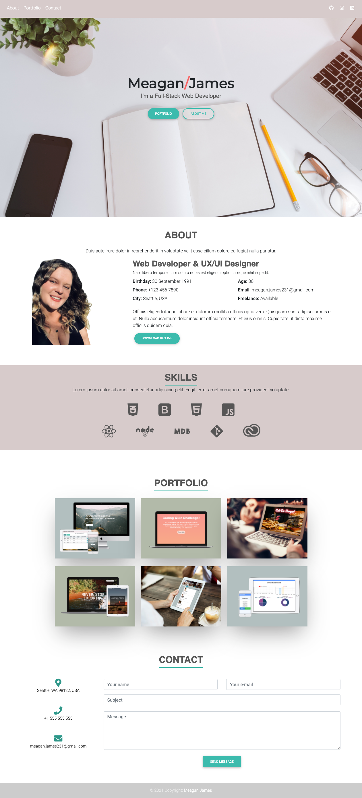

<h1 align="center"> #[Meagan James Dev Profile](https://github.com/merikettapearl212/mjreact-portfolio)</h1>

    
    
    

## Table of Contents
- [Description](#description)
- [Table of Contents](#table-of-contents)
- [Screenshot of example](#screenshot-of-example)
- [Questions](#questions)

## Description
An updated portfolio using react, containing most recent works, resume and links to other referneces. 

#### Screenshot of example:

## License

## Questions
:mailbox: Please contact me if you have any questions:
 
  
  
 

#### Powered by :coffee: and  

Thanks for stopping by! :vulcan_salute: